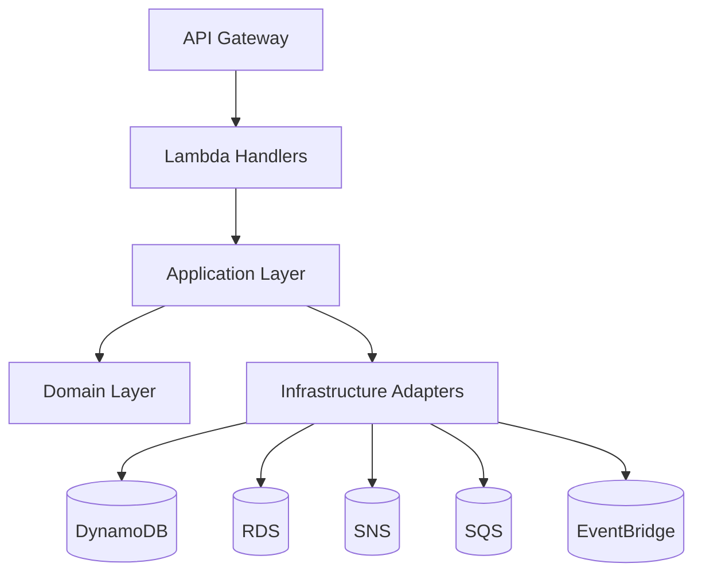
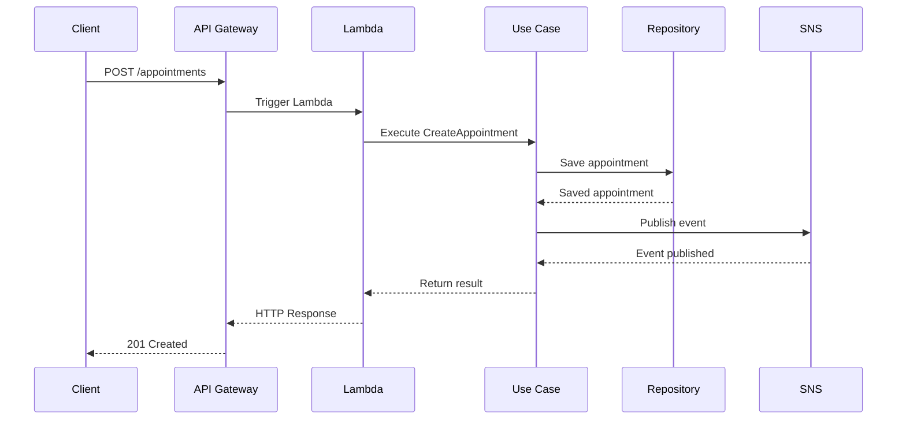
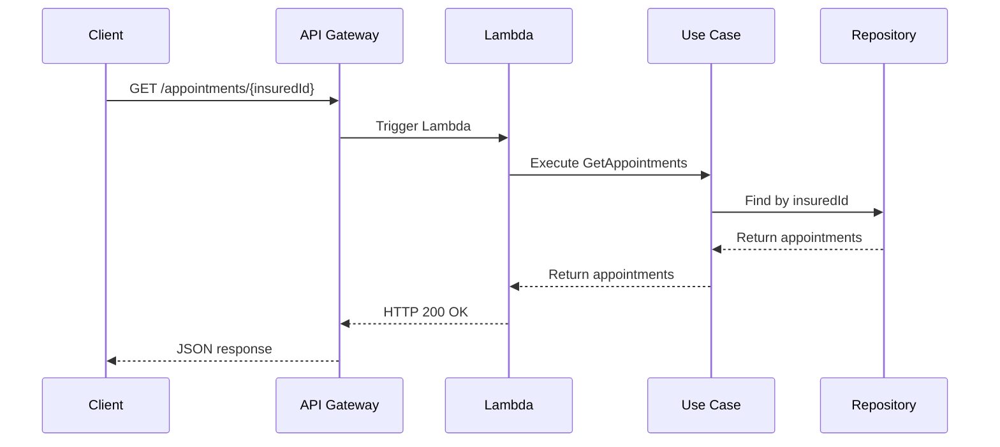

# 🏗️ Medical Scheduling Backend - Architecture

## 📐 Architectural Overview

This project implements a **Hexagonal Architecture** (Ports and Adapters) to ensure clear separation of concerns, testability, and maintainability. The system is designed to be cloud-native, serverless, and highly scalable, built on AWS services.

### Core Architectural Principles

- **Separation of Concerns**: Clear boundaries between domain, application, and infrastructure layers.
- **Testability**: Independent testing of each component.
- **Scalability**: Serverless components that scale automatically with demand.
- **Resilience**: Built-in retries, dead-letter queues, and circuit breakers.
- **Observability**: Comprehensive logging, metrics, and tracing.

## 🏛️ System Architecture



## 🗂 Project Structure

```
medical-scheduling-backend/
├── .github/                 # GitHub workflows and templates
├── docs/                    # API documentation
├── src/
│   ├── adapters/           # External service integrations
│   │   ├── dynamodb/       # DynamoDB repositories by country
│   │   ├── eventbridge/    # Event publishers
│   │   ├── rds/            # Relational database access
│   │   ├── sns/            # Notification publishers
│   │   └── sqs/            # Queue consumers
│   ├── application/        # Business logic and use cases
│   │   └── appointment/    # Appointment-specific logic
│   ├── domain/             # Core business models and interfaces
│   │   └── appointment/    # Appointment domain models
│   ├── handler/            # AWS Lambda entry points
│   │   ├── api/            # REST API handlers
│   │   └── queue/          # Queue processors
│   └── infrastructure/     # AWS service clients
├── tests/                   # Test suites
│   ├── unit/               # Unit tests
│   └── integration/        # Integration tests
├── .env.example            # Environment variables template
├── jest.config.ts          # Test configuration
├── package.json            # Project dependencies
├── serverless.yml          # Infrastructure as Code
└── tsconfig.json           # TypeScript configuration
```

## 🔄 Data Flow

### 1. Create Appointment Flow


### 2. Get Appointments Flow


## 🏗️ Infrastructure Components

### AWS Services Used

| Service | Purpose | Configuration |
|---------|---------|---------------|
| **API Gateway** | REST API Endpoints | Regional, API Key required |
| **Lambda** | Serverless Compute | Node.js 20.x, 1024MB RAM |
| **DynamoDB** | NoSQL Database | On-demand capacity |
| **RDS** | Relational Database | PostgreSQL 14, t3.micro |
| **SNS** | Pub/Sub Messaging | FIFO topics by country |
| **SQS** | Message Queues | Standard queues with DLQ |
| **EventBridge** | Event Bus | Default event bus |
| **CloudWatch** | Logging & Monitoring | 30 days retention |

## 🔒 Security Considerations

- **Least Privilege**: IAM roles with minimum required permissions
- **Encryption**: Data encrypted at rest and in transit
- **API Security**: API keys required for all endpoints
- **Secrets Management**: Environment variables via AWS Parameter Store

## 📈 Performance & Scaling

- **Concurrency**: 1000+ concurrent executions
- **Cold Start**: Optimized with provisioned concurrency
- **Database**: DynamoDB auto-scaling enabled
- **Caching**: Consider adding API Gateway caching for frequent requests

## 🔄 Deployment Strategy

- **CI/CD**: GitHub Actions for automated testing and deployment
- **Environments**: Dev, Staging, Production
- **Rollback**: Automated rollback on deployment failures
- **Infrastructure**: Managed via Serverless Framework

## 📝 Decision Records

### 1. Hexagonal Architecture
**Date**: 2025-05-22  
**Status**: Accepted  
**Context**: Need for testable, maintainable code  
**Decision**: Adopt Hexagonal Architecture  
**Consequences**: Clear separation but requires more boilerplate

### 2. Multi-Region Support
**Date**: 2025-05-22  
**Status**: Proposed  
**Context**: Need for lower latency in different regions  
**Decision**: Evaluate DynamoDB Global Tables  
**Consequences**: Increased complexity, higher costs

## 🔍 Future Improvements

1. Implement Circuit Breaker pattern for external service calls
2. Add distributed tracing with AWS X-Ray
3. Implement API Gateway caching for frequently accessed endpoints
4. Add GraphQL API layer for more flexible queries
5. Implement feature flags for controlled rollouts

## 📚 Related Documentation

- [AWS Well-Architected Framework](https://aws.amazon.com/architecture/well-architected/)
- [Serverless Best Practices](https://www.serverless.com/learn/best-practices/)
- [Hexagonal Architecture](https://alistair.cockburn.us/hexagonal-architecture/)
